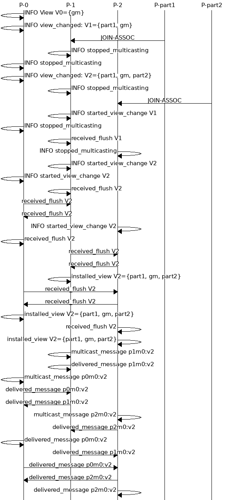

# Reliable multicast

An implementation of a constrained reliable multicast algorithm
using the Akka framework. For an overview on the design choices
and system behavior analysis check out the report provided
as a PDF file.

## Project structure

The project has been developed using the Gradle build tool.
Folders are structured as followed:

* `./src/main/java` contains code for classes developed
  for the project;

* `./src/main/resources` contains configuration files used
  by the Akka system to set up Akka actors. We provide
  6 actors with the naming convention `p<num-actor>.conf`, where
  `num-conf` is a number between 1 and 6. The group manager
  has a different name, i.e. `gm.conf`.

  It also contains json files used to define scenarios the system
  has to deal with;

* `./src/test` contains a single test file used to check the
  behavior of the `Message` class.

## Starting the system

The system has been implemented as a set of independent Akka networking
actors. Each actor has to be created in a separate Gradle session, as follows:

```
# in the project root directory
gradle run -Dconfig=<actor.conf>
```

Note the the group manager `gm.conf` should be the first
actor to be initialised.

### Defining the scenario file

JSON files defined in `./src/main/resources` state the
set of events and actions actors in the system have to
follow.

In this context we consider a participant to be in two possible
conditions:

* **automatic mode**: the actor starts and as it installs the first
  view it starts sending multicasts continuously. This is the
  behavior as requested by the project specification
* **manual mode**: the actor sends multicasts only when requested.
  The system plans the system execution dividing it into steps.
  Within a step the actor can be asked to send a multicast, to revive
  or to crash according to an action triggered by an event. An event
  is given as a message label made by the process id sending the message
  followed by the message id the process just sent i.e. `p<X>m<Y>`.
 
According to this, we provide two different kind of scenario files.
Scenarios in which actors performed in automatic mode are named with
a trailing **a** in the filename, e.g. *test1a.json*. These files
contain just the events used to trigger participants actions, without
scheduling neither their multicast behavior nor their revive operations.

We note that these files are given with a corresponding readme file
describing how the system should behave in the given scenario.

Other scenario files let the system execution be in manual mode.
This mode allows the system to run at a slower pace, allowing a fine grained
control over the system execution.

To start a participant, whose execution has to behave according
to a given scenario, the `-Djson` option is used:

```
# in the project root directory
gradle run -Dconfig=<actor.conf> -Djson=<testX.json>
```

We note that to follow a given scenario all participants
should be initialized with the same scenario file.

## Visualizing the execution graph

A shell file is provided to build a graph on the
system execution. In order for the script to 
generate a graph the `mscgen` program and the R
programming language interpreter are needed.

Mscgen can be install via aptitude issuing:

```
apt-get install mscgen
```
A version provided by the homebrew package distributor
is known to be available, but it has not been tested.

To generate the execution graph, logs printed in actor
consoles are required to be collected and saved into
a file named `tmp.log` together.
Once the file is created the shell script `gensmc.sh` can
be issued with `sh gensmc.sh`, the graph file will be
saved as `sequence.png`.

The figure depicts partly an example of the system execution.



